# 🎬 Bioskop Keren — Sistem Pemesanan Tiket Bioskop Online

Aplikasi web pemesanan tiket bioskop *full-stack* yang memungkinkan pengguna memilih film, jadwal tayang, dan kursi secara online, lengkap dengan alur pembayaran manual (upload bukti transfer) dan verifikasi oleh admin.

Terdapat dua role pengguna dengan hak akses berbeda: **Customer** (pemesan tiket) dan **Admin** (pengelola film, jadwal, dan verifikasi pembayaran).

---

## 🧰 Tech Stack

| Bagian | Teknologi |
|---|---|
| **Frontend** | React.js (React Router DOM v7, Axios) |
| **Backend** | Node.js + Express.js (REST API) |
| **Database** | MySQL / MariaDB |
| **Styling** | CSS-in-JS (inline `<style>` di dalam `App.js`) |
| **Autentikasi** | Login/Register sederhana berbasis tabel `users` (role: `admin` / `customer`) |
| **Lainnya** | QR Code generator (`api.qrserver.com`) untuk E-Tiket |

**Bahasa pemrograman utama:** JavaScript (ES Modules di backend, JSX di frontend).

### Struktur Folder

```
pemesanan-tiket-bioskop/
├── backend-app/          # Express REST API
│   ├── index.js          # Semua route API ada di sini
│   └── package.json
├── frontend-bioskop/     # React App (Create React App)
│   ├── src/App.js        # Semua halaman & routing ada di sini
│   └── public/
├── bioskop_keren.sql     # Dump database (struktur + data awal)
└── README.md
```

### Arsitektur

```
[ Browser ] → [ React (Frontend) : 3000 ] → [ Express REST API (Backend) : 3001 ] → [ MySQL : 3308 ]
```

---

## 👤 Role & Hak Akses

Role ditentukan dari kolom `role` pada tabel `users` (`admin` atau `customer`), dikirim ke frontend saat login lalu disimpan di `localStorage` (`authData`).

| Role | Bisa akses |
|---|---|
| **Guest** (belum login) | Lihat beranda & detail film, tidak bisa pesan tiket |
| **Customer** | Semua fitur guest + pesan tiket, pembayaran, riwayat tiket, e-tiket |
| **Admin** | Kelola film & jadwal, verifikasi pembayaran (tidak bisa memesan tiket) |

> ⚠️ **Catatan penting:** Aplikasi ini **tidak punya form untuk membuat akun admin baru** — form register (`/register`) hanya membuat akun dengan role `customer` (lihat `index.js`, endpoint `/api/register`). Akun admin sudah tersedia langsung dari data awal (seed) di `bioskop_keren.sql`.

### 🔑 Akun Admin Default

| Email | Password |
|---|---|
| `admin@bioskop.com` | `password123` |

### 🔑 Akun Customer Contoh

| Email | Password |
|---|---|
| `wahyuniseptianingsih07@gmail.com` | `password123` |

*(Atau buat akun customer baru sendiri lewat halaman Register.)*

---

## 🖼️ Tampilan Aplikasi — Role Customer

Alur customer diurutkan dari mulai membuka aplikasi sampai mendapat e-tiket.

### 1. Beranda (Daftar Film)
Menampilkan daftar film yang sedang tayang lengkap dengan poster. Bisa diakses tanpa login.

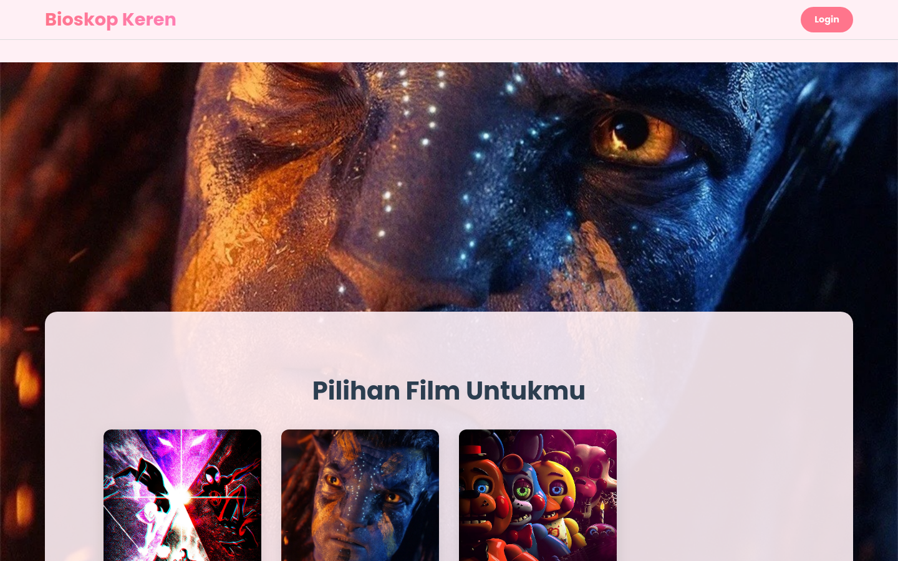

### 2. Halaman Login
Customer masuk menggunakan email & password yang sudah terdaftar.

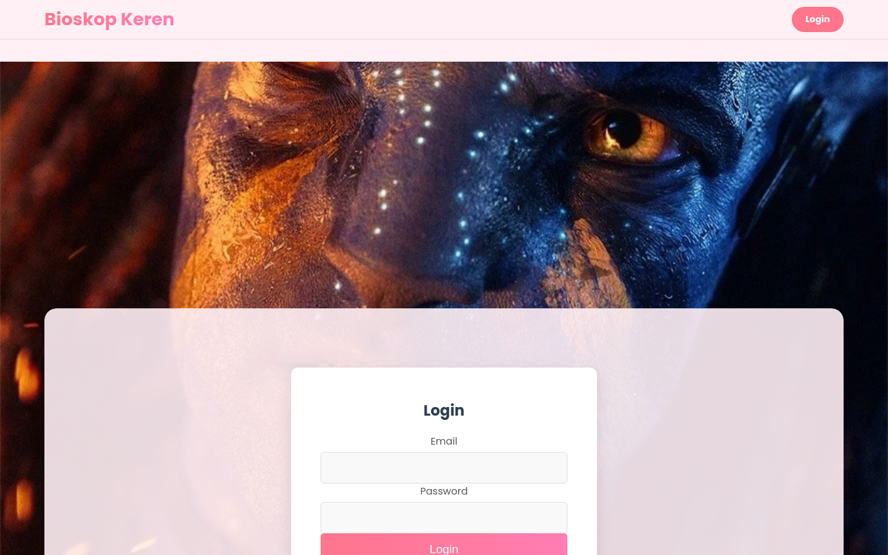

### 3. Halaman Register (Buat Akun Baru)
Pendaftaran akun baru — otomatis dibuat dengan role `customer`.

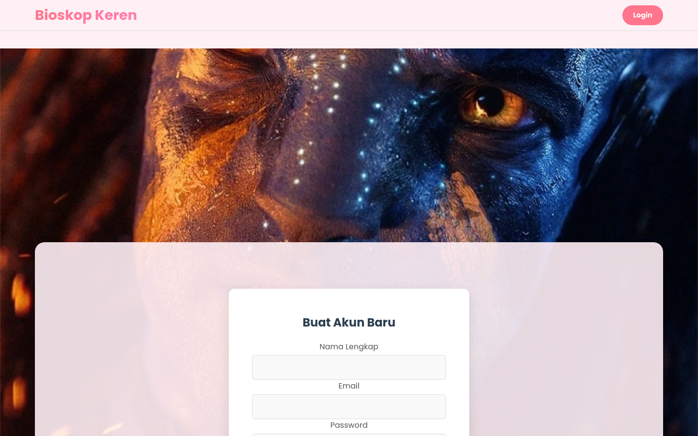

### 4. Beranda Setelah Login
Setelah login, navbar berubah menampilkan nama user, tombol **Tiket Saya**, dan **Logout**.

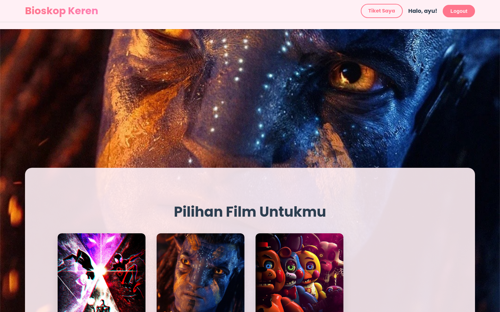

### 5. Detail Film & Pilih Jadwal
Menampilkan sinopsis, durasi, dan pilihan jadwal tayang (jam & studio) untuk film yang dipilih.

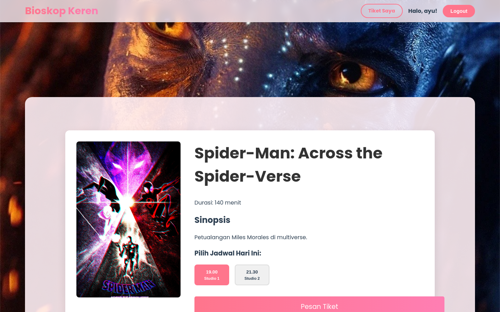

### 6. Pilih Kursi
Customer memilih kursi yang tersedia dari denah kursi studio (kursi yang dipilih berwarna pink).

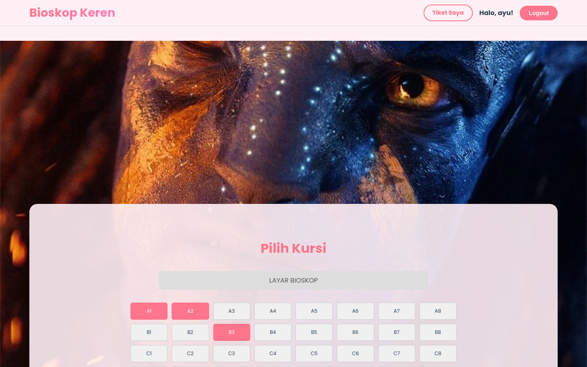

### 7. Konfirmasi Pembayaran
Customer memilih metode pembayaran (GoPay/OVO/Dana/Bank Transfer) dan mengunggah bukti transfer.

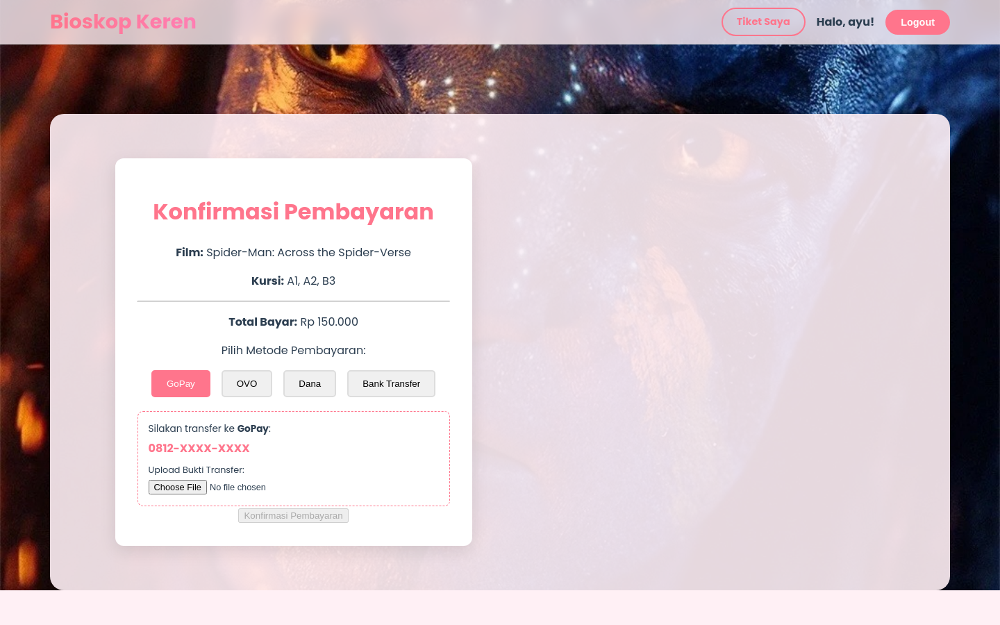

### 8. Riwayat Tiket Saya
Menampilkan seluruh riwayat pemesanan beserta statusnya: **Menunggu Verifikasi** (kuning) atau **Lunas / Siap Digunakan** (hijau) setelah dikonfirmasi admin.

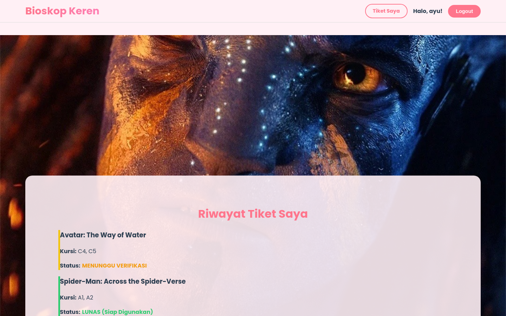

### 9. E-Tiket
Tiket digital dengan QR code yang bisa dipindai, muncul setelah pembayaran diverifikasi admin.

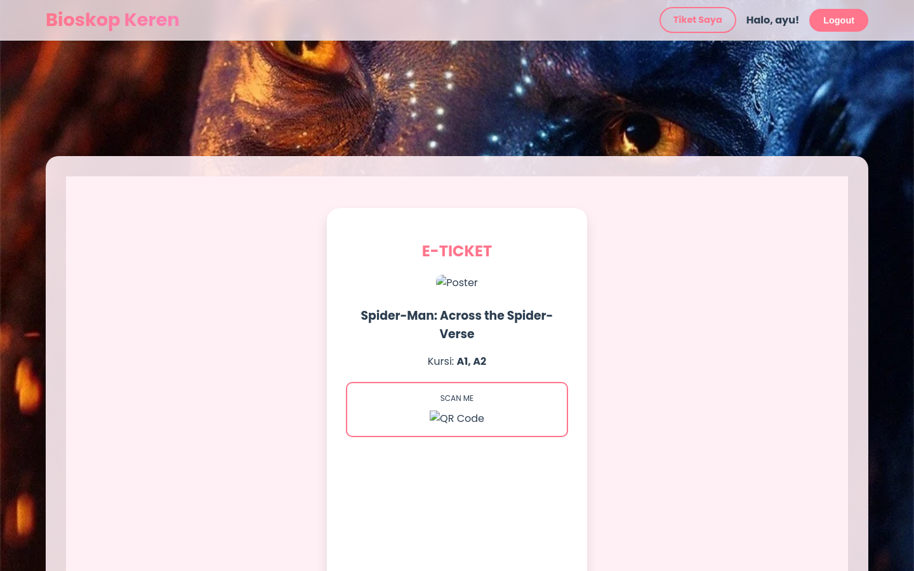

---

## 🖼️ Tampilan Aplikasi — Role Admin

### 1. Login Admin
Login menggunakan akun dengan role `admin`. Navbar menampilkan tombol **Halaman Admin**, bukan **Tiket Saya**.


### 2. Panel Admin (Dashboard)
Halaman utama admin: tombol tambah film & jadwal, tabel **Verifikasi Pembayaran User** (pembayaran berstatus *Pending*), daftar film, dan daftar jadwal.

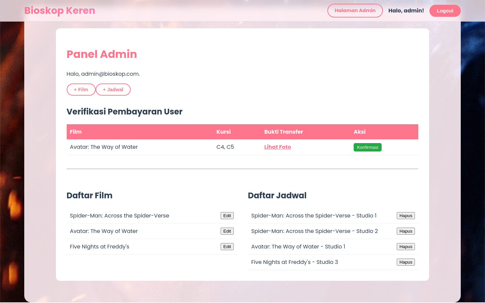

### 3. Tambah Film Baru
Form untuk menambah data film (judul, durasi, URL poster, sinopsis). Form yang sama juga dipakai untuk mengedit film.

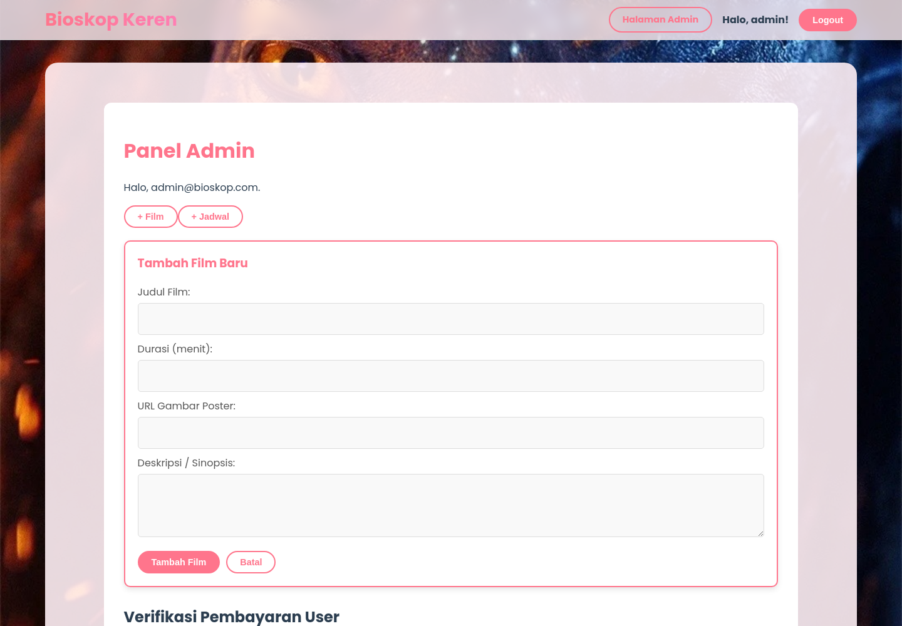

### 4. Tambah Jadwal Tayang
Form untuk menambah jadwal tayang baru (pilih film, waktu tayang, harga tiket, nama studio).

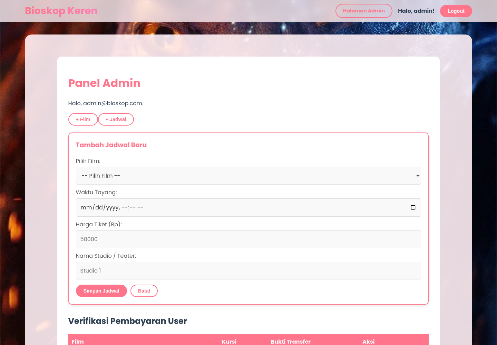

---

## ✨ Daftar Fitur Lengkap

**Customer**
- Register & Login
- Melihat daftar film yang sedang tayang
- Melihat detail film (sinopsis, durasi, jadwal tayang per studio)
- Memilih kursi dari denah kursi interaktif
- Melakukan pemesanan tiket & upload bukti pembayaran manual
- Melihat riwayat pemesanan tiket beserta status pembayaran
- Melihat E-Tiket dengan QR code setelah pembayaran diverifikasi

**Admin**
- Login sebagai admin (akun sudah tersedia dari seed database, tidak ada form pendaftaran admin)
- Melihat & memverifikasi daftar pembayaran yang masuk (menyetujui bukti transfer)
- Menambah film baru
- Mengedit data film yang sudah ada
- Menambah jadwal tayang baru (film, jam, harga, studio)
- Menghapus jadwal tayang

---

## ⚙️ Cara Menjalankan Proyek

### 1. Setup Database
Buat database MySQL/MariaDB bernama `bioskop_keren`, lalu import file `bioskop_keren.sql`:
```bash
mysql -u root -p bioskop_keren < bioskop_keren.sql
```
> Sesuaikan koneksi database (`host`, `user`, `password`, `port`) pada `backend-app/index.js` jika berbeda dari environment kamu (default: port `3308`).

### 2. Jalankan Backend
```bash
cd backend-app
npm install
node index.js
```
Backend berjalan di `http://localhost:3001`.

### 3. Jalankan Frontend
```bash
cd frontend-bioskop
npm install
npm start
```
Frontend berjalan di `http://localhost:3000`.

### 4. Login
- **Sebagai Admin** → `admin@bioskop.com` / `password123`
- **Sebagai Customer** → daftar akun baru lewat halaman Register, atau gunakan akun contoh di atas.

---

## 📝 Catatan Teknis

- Password pada tabel `users` masih disimpan dalam bentuk teks biasa (belum di-hash) — cocok untuk pembelajaran/skripsi, namun **tidak disarankan untuk produksi**.
- Endpoint booking (`POST /api/bookings`) tidak melakukan pengecekan kursi yang sudah dipesan orang lain di sisi backend (validasi kursi terpakai saat ini hanya di state frontend).
- Beberapa endpoint admin (tambah/edit film, tambah/hapus jadwal, verifikasi pembayaran) belum memiliki middleware pengecekan role di backend — pengecekan role saat ini hanya dilakukan di sisi frontend (routing React).

---

## 👩‍💻 Dibuat oleh

**Wahyuni Septianingsih** — Mahasiswa Informatika, Universitas Amikom Purwokerto
